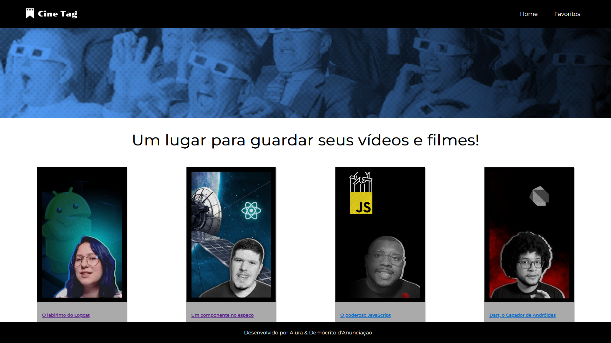

# Alura - Cinetag :cinema:

:us:
This is a "React: practicing React with Js" course's project from [Alura](https://alura.com.br) where a website is developed with a movies library, where it is possible to see movies details, watch, and evaluate them.
This project was created with the `create-react-app` command and uses routes with `react-router-dom` and context with `context API`.

:brazil:
Projeto do curso "React: praticando React com Js" da [Alura](https://alura.com.br) onde se desenvolve um site com uma biblioteca de filmes, onde é possível ver os detalhes dos filmes, assistí-los e avaliá-los.
Este projeto foi criado com o comando `create-react-app` e utiliza rotas com `react-router-dom` e contexto com o `context API`.

### Author
[Demócrito d'Anunciação](https://github.com/democrito88)